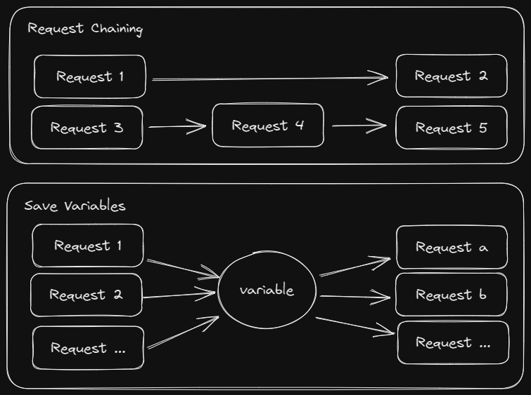
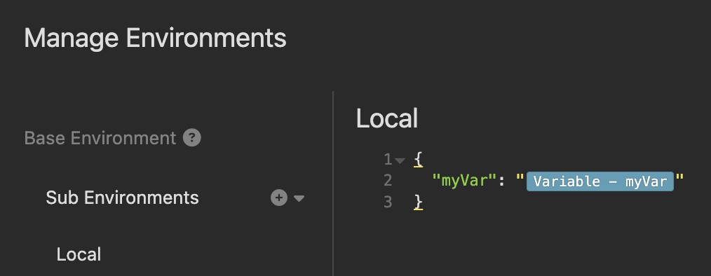

# insomnia-plugin-save-variables

An [Insomnia](https://insomnia.rest) Plugin that saves values into variables
after a request completes. It provides an alternative to Insomnia's built-in
[request chaining](https://support.insomnia.rest/article/175-chaining-requests).



## Installation

Install the `insomnia-plugin-save-variables` plugin from Preferences > Plugins.

## Tutorial

1. Create the following request. This uses the insomnia-plugin-fake plugin to generate a random color, but you can use a UUID or manually enter a value if preferred.


2. Click on the "Variable - " tag and enter a name.


3. The Live Preview shows there is no variable defined. Fix that by clicking "Manually Update Value"
and entering "blue" or a color of your choice. Now the variable shows the value that
you entered.

4. Click "Send" a few times. In the response you can see the echoed request. The randomColor
value changes every request, but the savedColor value stays the same.

5. On the Headers tab, add a Virtual Header using the "Save Variables" tag. This header
tells the plugin how to save a variable during the request lifecycle. The Virtual Header
needs to be placed on the left side representing the header name, and it does not need
a value on the right side.


5. Click on the "Save Variable - " tag and fill out the fields.


6. The Live Preview shows base64 encoded text. This is an internal plugin detail that 
can be ignored. The header itself does not get sent with the request.
The plugin strips it off of the request before it is sent.

7. Click "Send" a few times. Notice that the savedColor value changes each time. The
savedColor matches the randomColor from the previous request.

## Features

Save values from multiple sources:
- Response Body
- Response Headers
- Request Body
- Request Headers
- Response Status Code
- Static Values

Extract values using multiple processors:
- JSONPath
- JMESPath
- XPath
- Raw

Delete variables
- Delete manually
- Delete during a request
- Delete only when status code matches the desired value

And more!

## Other Tags
### Review All Variables
The `All Variables` tag is useful for inspecting which variables you have saved.

### Delete a variable
Similar to defining a variable, the `Delete Variable` tag can be added to a request
header. It will delete the variable whenever the request is sent. Optionally it will
only delete the variable if the status code of the response matches a provided
regular expression.

## More Information
The variables are stored into the plugin's private storage. They are not saved as 
environment variables and are not exported.

Variables are scoped to the current workspace/collection.

### How to "Save" values to an environment variable

The Insomnia plugin API does not have a way to save values directly to environment variables,
but with a workaround you can get a similar experience.

Simply create an environment variable that uses the "Variable" template tag as its value.
This allows you to access a saved variable by using the environment variable.



## Troubleshooting
Open the Developer Tools in Insomnia and review the console logs sent by this plugin.
A log entry will appear for each variable that the plugin attempted to save.

## Development

Create a `.env` file in this repo with the following contents:
```
# Set to the location of the insomnia plugins folder (in Insomnia, go to
# Preferences -> Plugins, then click Reveal Plugins Folder)
# Default values are:
# MacOS: ~/Library/Application\ Support/Insomnia/plugins/
# Windows: %APPDATA%\Insomnia\plugins\
# Linux: $XDG_CONFIG_HOME/Insomnia/plugins/ or ~/.config/Insomnia/plugins/
PLUGINS_DIRECTORY=/mnt/c/Users/your_username/AppData/Roaming/insomnia/plugins
```

To install the plugin into Insomnia locally, run `install-plugin.sh`, then
refresh plugins in Insomnia or restart Insomnia.
